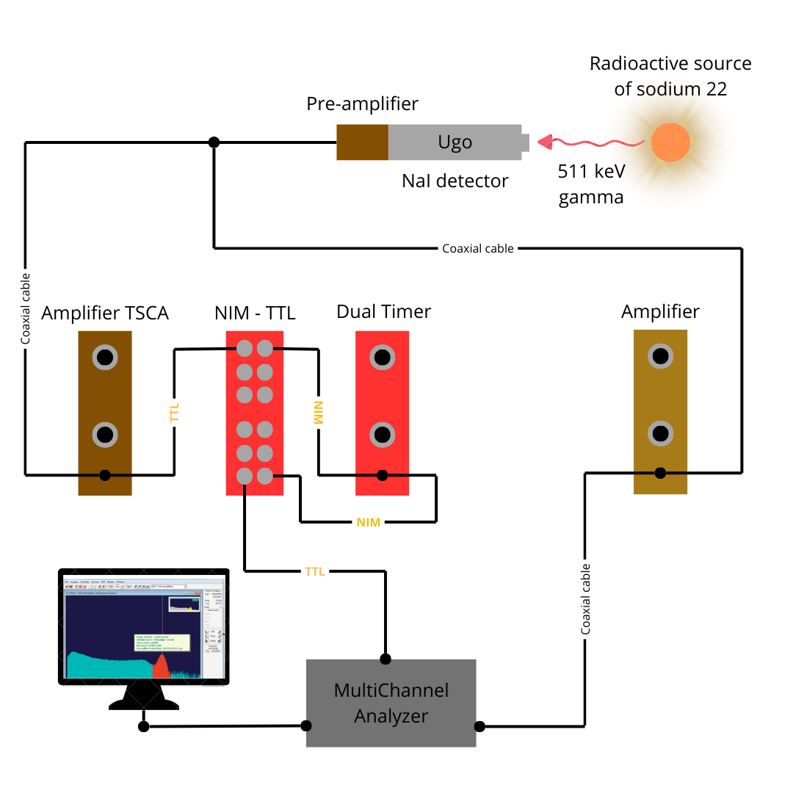
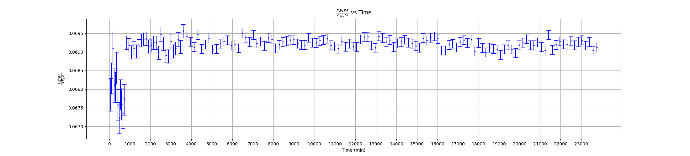
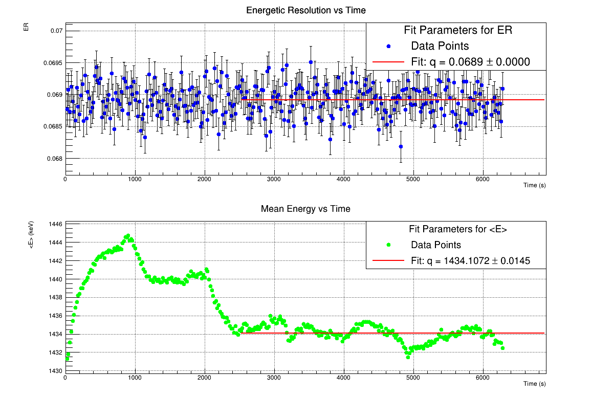

# Study of Compton Effect with NaI Detector

This repository contains the code and images related to our work in a particle physics laboratory, where we are studying the **Compton Effect** using two **NaI scintillation detectors** and a radioactive source of **Na-22**.

---

## Experimental Setup

  

We named the detector used for gating **Ugo** and the one dedicated to spectroscopy **Franco**.

### Components
1. **Radioactive Source (Na-22):**
   - Emits two 511 keV gamma rays in opposite directions due to positron annihilation.

2. **NaI Detectors ("Ugo" and "Franco"):**
   - Detect gamma rays at specific scattering angles.
   - Each detector is connected to a pre-amplifier for signal amplification.

3. **Pre-amplifiers:**
   - Amplify the electrical signals produced by the NaI detectors.

4. **Amplifier:**
   - Further process the signals received from the pre-amplifiers.

5. **Amplifier TSCA:**
   - Further process the signals received from the pre-amplifiers.
   - The TSCA acts as a single-channel analyzer (SCA), selecting signals based on their amplitude, which corresponds to the energy of the detected gamma ray.
   - The TSCA generates timing signals (TTL) when a valid event is detected.

6. **NIM-TTL Converter:**
   - Converts NIM signals to TTL signals for compatibility with other electronic components.

7. **Dual Timer:**
   - Generates precise timing signals to gate the data acquisition.

8. **MultiChannel Analyzer (MCA):**
   - Records the energy spectrum of detected gamma rays and visualizes it on a computer.

9. **Target (Optional):**
   - Serves as the scattering medium for gamma rays, used to measure Compton scattering.

### Signal Flow
1. Gamma rays from the Na-22 source are detected by the NaI detectors ("Ugo" and "Franco").
2. The electrical signals from the detectors are sent to their respective pre-amplifiers through coaxial cables.
3. The amplified signals are routed to the amplifier and amplifier TSCA, where further processing occurs.
4. Signals from the amplifier TSCA (TTL) is sent to the NIM-TTL converter to ensure compatibility with the Dual Timer.
5. The Dual Timer stretches the signal to make it correctly readable by the MCA.
6. Signals from the Dual Timer (NIM) is sent to the NIM-TTL converter to ensure compatibility with the MCA.
7. The processed signals are analyzed by the MCA and displayed on a computer, showing the energy spectrum of the detected events.

---

## Characterization of the electronic chain
### Choosing the best parameters for the amplifiers
We need to determine the optimal High Voltage (HV) and Gain settings for the Ugo detector, in combination with the TSCA amplifier, as well as for the Franco detector coupled with its amplifier. This ensures the detectors operate with maximum energy resolution and signal quality.

  
  

Analyzing these images we can see how the best values are:

  - **Ugo:** (HV = 600, Gain = 20)
  - **Franco:** (HV = 650, Gain = 100)

We select these values to minimize the energy resolution, $\frac{\text{FWHM}}{\langle E \rangle}\$, while avoiding operation near the boundary of the detector's optimal performance range. 

  
  

However, after evaluating the number of channels utilized out of the total 2048 with these parameters, we decided to adjust the settings and selected the following values:

  - **Ugo:** (HV = 900, Gain = 20) 
  - **Franco:** (HV = 600, Gain = 50) 

### ADC linearity
We need to verify the linearity of the Analog-to-Digital Converter (ADC). To do this, we began by using pulses with Gaussian shaping. Our measurements showed that the linearity is well maintained up to the first 300 channels. However, we encountered a limitation with the pulse generator module, which cannot produce amplitudes higher than 7 volts.

  
  
  

To address the issue described above, we replaced the module and were required to switch to semi-Gaussian shaping for the pulses.

  
  
  

Both types of shaping show linearity, but we observe two distinct linearity curves. 
Since the photopeak for the Franco detector is located around channel 1400, and the entire Compton spectrum falls below channel 1000, we are not concerned with studying the discontinuity observed near channel 1300.

### Auto-coincidence measurement

For this measurement, we modified the experimental setup to observe the spectrum detected by Ugo, the gate detector. To achieve this, the signal was duplicated and sent to both the amplifier and the TSCA.

  

In this configuration, it is possible to select the optimal signal window. Specifically, we focus on isolating the photopeak of the 511 keV gamma ray, as shown in the following figure: 

  

### Stability
Before the Christmas holiday, we turned off the high voltage (HV) for a full day to study the stability of the photopeak position after a prolonged blackout.

 
_vs_time.png" alt="Photopeak Energy Stability" width="100%">  

Our observations revealed significant oscillations in the photopeak position and energy resolution, with values that differed considerably from those recorded at the beginning of the laboratory. However, after conducting additional measurements in the following weeks, we noticed that the system became more stable over time. Interestingly, the stability settled at values distinct from the initial measurements.

This discrepancy is attributed to the changes in the setup. When the initial measurements were performed, the NIM-TTL converter and the Dual Timer were not yet integrated into the system. 

 
 

Based on our latest results, we consider the following to be the optimal and stable parameters for the system:

- $\frac{\text{FWHM}}{\langle E \rangle} = 0.068916 \pm 0.000018$
- $\langle E \rangle = 1434.107 \pm 0.015$ (Represents the channel number corresponding to the photopeak position)

---
## Target 

### Target material 
We conducted a simulation to study how the probability of Compton interaction within the target varies with the target's thickness for different materials: copper(Cu), lead(Pb), and aluminum(Al). From these studies, we observed that **copper provided the highest probability of interaction**, making it the most suitable choice for our experiment.

 
 

Additionally, we analyzed how the probability of a second Compton scattering event changes with the target's thickness. 

 
 

While copper exhibited significantly higher values compared to the other materials, this probability was found to be approximately 0.4%. Given its negligible contribution to the overall measurements, we consider it insignificant for our purposes.

### Target dimension

We calculated the optimal thickness of the target for various energies and decided to use a target thickness of **1 cm**. Below is a summary of the results for different energies:

| Energy (MeV) | Thickness (cm) |
|---------------|-----------------|
| 0.2      | 0.4537112315       |
| 0.3      | 0.9257343299        |
| 0.4      | 1.166766302      |

### Target structure 

We built the target structure using LEGO bricks.

 
 

To precisely rotate the target, we will use two servo motors controlled by an Arduino. One of these servo motors moves a laser to accurately align the spectroscopy detector, which will be positioned at a minimum distance of 60 cm from the target. The second servo motor will be responsible for rotating the target itself to specific angles required for the measurements.

