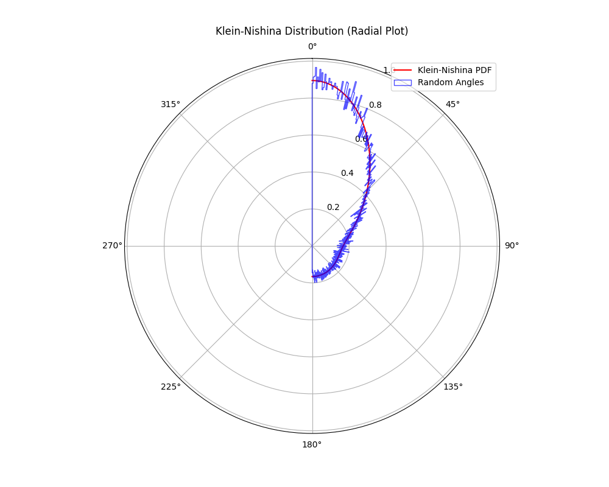
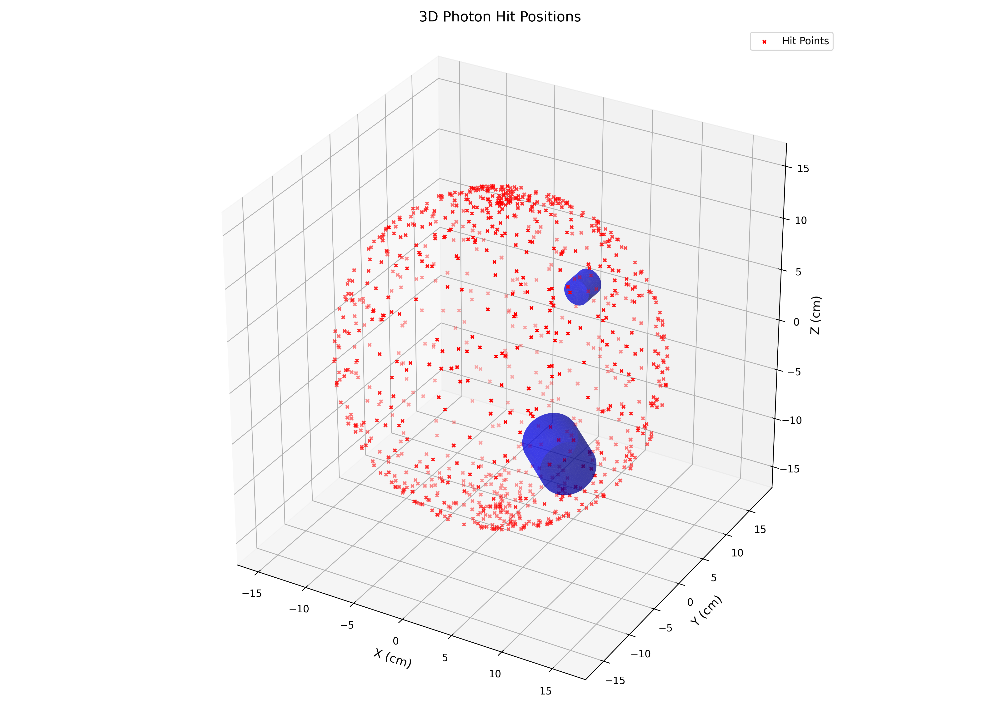

# Gamma Scattering Simulation

This repository provides a comprehensive simulation framework for modeling and analyzing gamma-ray interactions, particularly focusing on Compton scattering experiments. The project is structured with modular classes and functions to facilitate various experimental setups and visualizations.

## Dimension of the physical variables
- Length in **cm**.
- Energy in **keV**.
- Masses in **g**.

## Table of Contents

- [Overview](#overview)
- [Photon Interaction Types](#photon-interaction-types)
- [Implemented Classes](#implemented-classes)
- [Simulation Experiments](#simulation-experiments)
- [Visualization](#visualization)

## Overview

The simulation framework models gamma-ray interactions specifically for low-energy photons characteristic of the Na-22 spectrum. This radioactive isotope decays via beta-plus (β⁺) decay, producing a positron that subsequently annihilates with an electron, emitting two 511 keV gamma photons in opposite directions. Additionally, Na-22 emits a 1274 keV gamma photon following its decay to an excited state of neon-22. 

<div align="center">
  
</div>

Given the energy range of interest, the simulation focuses on two dominant interaction processes: **Compton scattering** and **photoelectric effect**, omitting **pair production** due to its higher energy threshold. 

The framework provides an environment for simulating real-world particle interactions, supporting key experimental configurations:

- **Gamma-Ray Spectroscopy**: Analyze energy spectra from Na-22, identifying characteristic peaks at 511 keV and 1274 keV.
- **Coincidence Detection**: Simulate the simultaneous detection of 511 keV photons resulting from positron annihilation, crucial for studies in positron emission tomography (PET) and correlated photon measurements.

In addition, the framework integrates 3D visualization tools. These tools allow users to explore photon trajectories, detector arrangements, and scattering targets, enhancing comprehension of photon-matter interactions and supporting intuitive and detailed analysis of gamma-ray behavior and scattering dynamics. 

---

## Photon Interaction Types

In this simulation, the interactions considered are **Compton scattering** and **photoelectric absorption**, as they are the most significant processes for 511 keV photons. **Pair production** is excluded because it occurs only at photon energies above 1.022 MeV, which is beyond the energy range of interest. 

### Thomson scattering cross-section

The **Thomson scattering cross-section** is given by:

$$
\sigma_{\text{Thomson}} = \frac{8}{3} \pi r_e^2
$$

Where $r_e = 2.817 \cdot 10^{-15}$ m is the **classical electron radius**.


### 1. Photoelectric Effect
A photon is completely absorbed by an atom, ejecting an electron with energy equal to the photon's energy minus the binding energy of the electron.

<div align="center">
  
</div>

#### Cross-section calculation
The cross-section for the photoelectric effect is computed using a formula involving the atomic number of the detector material and the photon's energy (form https://en.wikipedia.org/wiki/Gamma_ray_cross_section).

The **Photoelectric cross-section** is computed using:

$$
\sigma_{\text{photoelectric}} = c \left( \frac{Z m_e}{E_{\gamma}} \right)^5 \left( \gamma^2 - 1 \right)^{3/2} \left[ \frac{4}{3} + \frac{\gamma (\gamma - 2)}{\gamma + 1} \left( 1 - \frac{1}{2 \gamma \sqrt{\gamma^2 - 1}} \ln \left( \frac{\gamma + \sqrt{\gamma^2 - 1}}{\gamma - \sqrt{\gamma^2 - 1}} \right) \right) \right]
$$

where:
- $c = \frac{3}{2} \alpha^4 \sigma_{\text{Thomson}}$.
- $\gamma = \frac{E_{\gamma} + m_e - E_b}{m_e}$.
- $E_{\gamma}$ is the **photon energy**.
- $m_e$ = 511 keV is the **electron rest mass energy**.
- $E_b \approx 0$ is the **bond energy** for the electron.
- $Z$ is the **atomic number**.
- $\alpha\approx \frac{1}{137}$ is the **fine-structure constant**.
 
### 2. Compton Scattering
A photon collides with an electron, transferring part of its energy to the electron, which is ejected from the atom. The photon scatters with reduced energy and changes direction.

<div align="center">
  
</div>


#### Cross-section calculation
The cross-section for Compton scattering is computed based on the Thomson scattering cross-section and other parameters like the photon energy and the scattering angle (form https://en.wikipedia.org/wiki/Gamma_ray_cross_section).

The **Compton cross-section** is computed using:

$$
\sigma_{\text{Compton}} = c Z \left[ \frac{(1 + \epsilon)}{\epsilon^2} \left( \frac{2(1 + \epsilon)}{1 + 2\epsilon} - \frac{\ln(1 + 2\epsilon)}{\epsilon} \right) + \frac{\ln(1 + 2\epsilon)}{2\epsilon} - \frac{1 + 3\epsilon}{(1 + 2\epsilon)^2} \right]
$$

where:
- $c = \frac{3}{4} \sigma_{\text{Thomson}}$.
- $\epsilon = \frac{E_{\gamma}}{m_e}$.
- $E_{\gamma}$ is the **photon energy**.
- $m_e$ = 511 keV is the **electron rest mass energy**.

---

### Interaction Probability and Attenuation  

The probability of interaction for a photon traveling through a material depends on the **total cross-section** and material properties such as density and molar mass. This is calculated in two steps:  

#### Attenuation Factor  

The **attenuation factor** is defined as the inverse of the photon's mean free path in the material:  

$$
\mu = \frac{\rho \cdot N_a}{\text{MM}} \cdot \sigma_{tot}
$$

where:  
- $N_a = 6.022\cdot 10^{23}$ 1/mol is the **Avogadro's number**.  
- $\rho$ is the **density** (in g/cm^3) of the scattering material.
- $\text{MM}$ is the **molar mass** (in g/mol) of the scattering material.
- $\sigma_{tot}$ is the **total cross section**, calculated combining the contributions of the photoelectric and Compton cross-sections.

#### Interaction Probability  

Using the attenuation factor, the probability of photon interaction after traveling a distance $d$ in the material is:  

$$
\wp = 1 - e^{-\mu d}
$$    


<div align="center">
  
</div>  


---

## Implemented Classes

The simulation framework is built upon two base classes—`Object` and `Particle`—from which specialized classes inherit. This modular design facilitates consistent geometry, visualization, and particle handling across the simulation.

- **Particle (Base Class)**: Provides common functionality for all particles.
  - **Photon**: A subclass of `Particle` that represents a gamma-ray photon with energy, position, and direction.
  - **Electron**: A subclass of `Particle` that models the electron produced during scattering events.
  
- **Object (Base Class)**: Provides basic methods for defining and visualizing cylindrical geometries.
  - **Detector**: A subclass of `Object` that simulates a cylindrical gamma-ray detector. It includes refined geometric routines for 3D visualization and methods to check if a photon (or interaction point) lies within its volume.
  - **Target**: A subclass of `Object` that represents the material medium where Compton scattering or other photon interactions occur. It provides methods to verify if a point is inside the target and to visualize it in 2D/3D.

Additional key classes include:

- **Source**: Represents a gamma-ray source (e.g., Na-22) emitting photons.  
  - **Methods** include random energy and direction generation, as well as routines to emit lists of `Photon` objects (both with randomized and fixed directions for testing).
  
- **Interaction**: Models the interaction processes (photoelectric effect and Compton scattering) between photons and matter.
  - Exploits dynamic material properties and supports updated cross-section calculations.
  - **Methods** include `cross_section(photon)` for the interaction probability and `interaction(photon)` that simulates the reaction, returning either an electron or a photon-electron pair.

---
### 1) `Particle`
```python
particle = Particle(energy: float, direction: list[float], position: list[float] = [0,0,0])
```
Represents a particle with energy, direction, and position.
- **Attributes**: `energy`, `direction`, `position`.
- **Methods**:
    - `info()`: Prints detailed information about the photon.
    - `propagation(distance)`: Computes the photon position after traveling a specified distance.


### 1.a) `Photon`
```python
photon = Photon(energy: float, direction: list[float], position: list[float] = [0,0,0])
```
Represents a photon with energy, direction, and position.
- **Other methods**:
    - `compton_scattering(angle)`: Calculates the scattered photon energy.
    - `klein_nishina(angle)`: Computes the differential cross-section for Compton scattering.
    - `compton_angle()`: Generates random scattering angles through rejection sampling based on the Klein-Nishina probability density function.
    
<p align="center">
  
  
</p>

### 1.b) `Electron`
```python
electron = Electron(energy: float, direction: list[float], position: list[float] = [0,0,0])
```
Represents an electron with energy, direction, and position.
- **Attributes**: `energy`, `direction`, `position`.
- **Other methods**:
    - `compton_scattering(angle, photon)`: Calculates the post-interaction energy of the electron after a Compton scattering event.

### 2) `Radioactive Source`
```python
source = Source(energies: dict = {511: 0.903, 1274: 0.097}, position: list[float] = [0,0,0], activity: int = 127000)
```
Simulates a radioactive source emitting gamma photons. Customizations include energy distributions, spatial positions, and activity levels.
- **Attributes**: `energies`, `position`, `activity`.
- **Methods**:
    - `info()`: Prints detailed information about the source.
    - `random_energies(number_of_photons: int = 1) -> np.ndarray`: Generates random photon energies based on the source’s energy probabilities.
    - `random_directions(number_of_photons: int = 1) -> np.ndarray`: Generates random unit vectors to represent photon directions.
    - `photon_emission(number_of_photons: int = 1) -> list`: Returns a list of `Photon` objects with randomized properties.
    - `testing_photons(number_of_photons: int = 1, direction: list = [0, 1, 0]) -> list`: Returns a list of `Photon` objects with fixed directions and randomized energies for testing purposes.

### 3) `Object`
```python
object = Object(position: tuple[list[float], list[float]], radius: float, Z: float, density: float, molar_mass: float)
```
Represents a cylindrical object that serves as the foundation for physical geometries in the simulation. This base class provides methods for defining, analyzing, and visualizing objects such as detectors and targets.

- **Attributes**:  
  - `position`(a tuple contain the position of the centers of the two basis of the cylindrical object), `radius`, `Z`, `density`, `molar_mass`.
- **Methods**:  
  - `info()`: Prints detailed information about the object's properties.   
  - `principal_axis() -> np.ndarray`: Computes and returns the principal axis vector of the cylinder by taking the difference between the two defining point of the position tuple.  
  - `center() -> np.ndarray`: Calculates the geometric center (midpoint) of the object based on its defining positions.  
  - `is_inside(point: np.ndarray) -> bool`: Verifies whether a given point (for example, a photon hit) lies within the object's cylindrical volume. 
    To handle also rotated objects, we first transform the coordinate system so that the object's principal axis aligns with the global y-axis. In other words, before checking whether a given point lies within       the object, the space coordinates are rotated accordingly.
    Let
     
$$
\hat{v}_{Obj} = \frac{\vec{v}_{Obj}}{|\vec{v}_{Obj}|}
$$

   be the unit vector along the object's principal axis. The angle, $\alpha$, between this axis and the global y-axis is determined by

$$
\sin(\alpha) = \left|\hat{y}\times\hat{v}_{Obj}\right|
$$

   Then, the coordinate transformation is achieved using the rotation matrix

$$
\vec{x}' = \begin{bmatrix}
\cos(\alpha) & 0 & \sin(\alpha) \\
0 & 1 & 0 \\
-\sin(\alpha) & 0 & \cos(\alpha)
\end{bmatrix} \cdot \vec{x}
$$

   After translating the point by subtracting the object's center, the above rotation aligns the object’s axis with the y-axis. In that rotated frame, the inclusion test is simplified: the radial distance         (computed from the x- and z-components) is compared with the object's radius, and the y-coordinate is checked against half the length of the object.

  - `rotate(theta: float, axis: str)`: Rotates the object about its center along a specified axis (either "x", "y", or "z").  
  - `detection(electron: Electron) -> float`: Simulates the energy detected from an electron interacting with the object.  
  - `draw_3D(ax, axis='y', color='blue', alpha=0.5, label=None)`: Renders a detailed 3D visualization of the cylindrical object using matplotlib, including routines for proper scaling and orientation.

### 3.a) `Detector`
```python
detector = Detector(position: list[float], radius: float, width: float, energetic_resolution: float,
                    Z: float = 49.7, density: float = 3.67, molar_mass: float = 149.89)
```
Represents a cylindrical gamma-ray detector. We consider the detector by default as a NaI scintillator, with the appropriate values for the material constants.
- **Other attributes**: `energetic_resolution`.
- **Other methods**:
    - `resolution(energy: float) -> float`: Simulates detector resolution by adding Gaussian noise to the true energy.
    - `detection(electron: Electron) -> float`: Simulates the energy detected from an interacting electron.

### 3.b) `Target`
```python
target = Target(position: list[float], radius: float, Z: float = 29, density: float = 8.96, molar_mass: float = 63.55)
```
Represents a cylindrical target. We consider the target material by default of Copper.

### 4) `Interaction`
```python
interaction = Interaction(type: str)
```
Models the photon interaction processes (photoelectric effect and Compton scattering) using updated cross-section formulas and dynamic material properties.
- **Attributes**: `type`("photoelectric" or "compton").
- **Methods**:
    - `info()`: Displays the interaction type and detailed material properties.
    - `cross_section(photon: Photon, Z: float)`: Calculates the cross-section for the specified interaction based on updated dynamic material properties.
    - `interaction(photon: Photon)`: Simulates the interaction (photoelectric or Compton), returning a resulting product (an electron or a photon-electron pair).

---

## Spectroscopy of Na-22 Spectrum

Simulates the energy spectrum emitted by a Na-22 gamma-ray source, modeling the detection of characteristic energy peaks. The updated libraries now support customizable detector materials and dynamic scaling.
<p align="center">
  
</p>

## Visualization

The simulation includes advanced 3D visualization capabilities that allow users to:

- Display the gamma-ray source and photon trajectories.
- Visualize the spatial arrangements of detectors and targets.
- Explore the spatial distribution of photon interactions.

The latest updates feature dynamic scaling of visualizations based on the actual dimensions of detectors and targets.
<p align="center">
  
</p>
