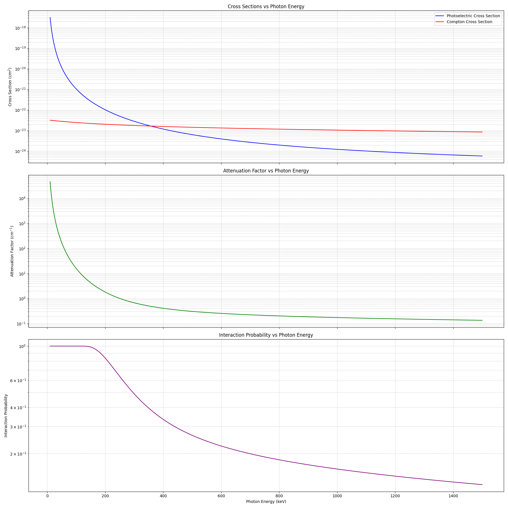
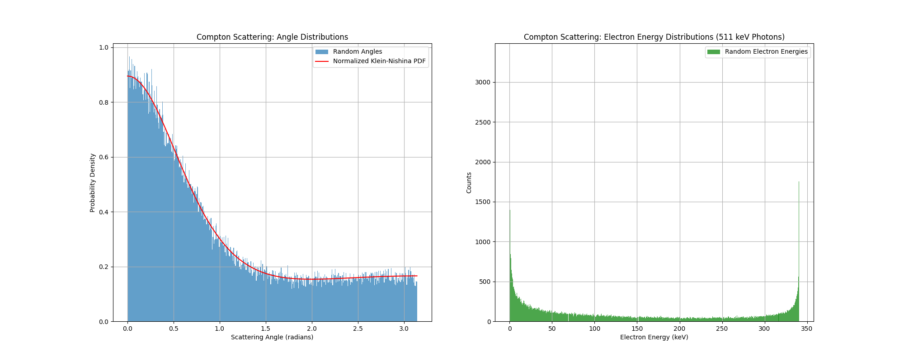
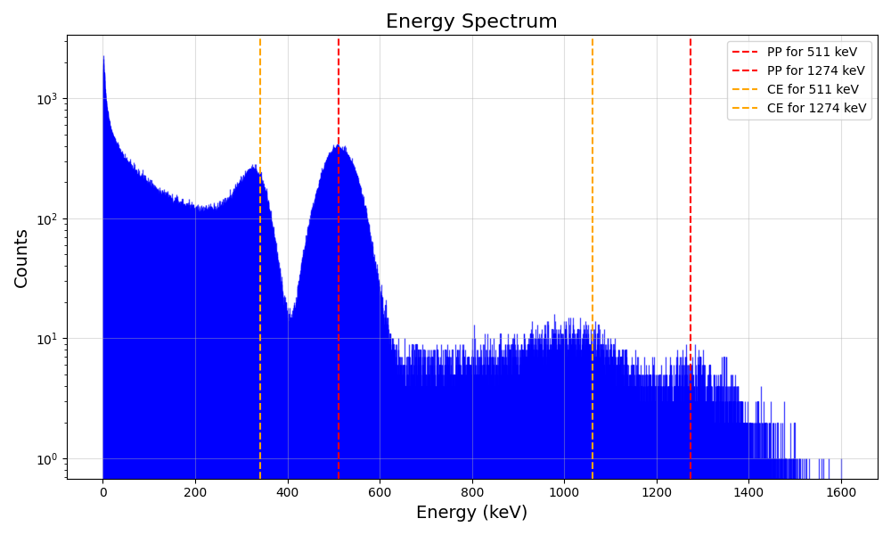
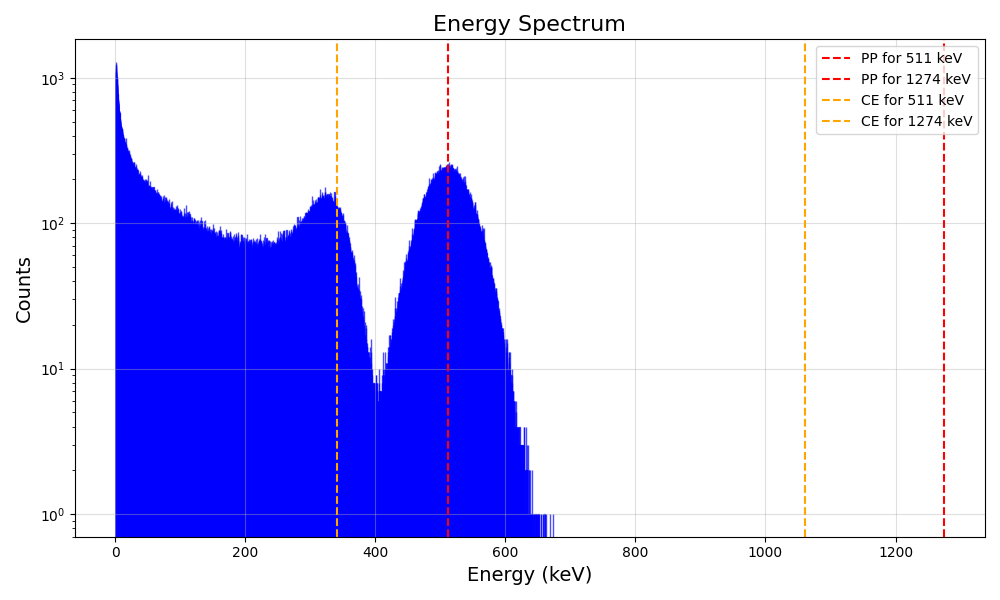
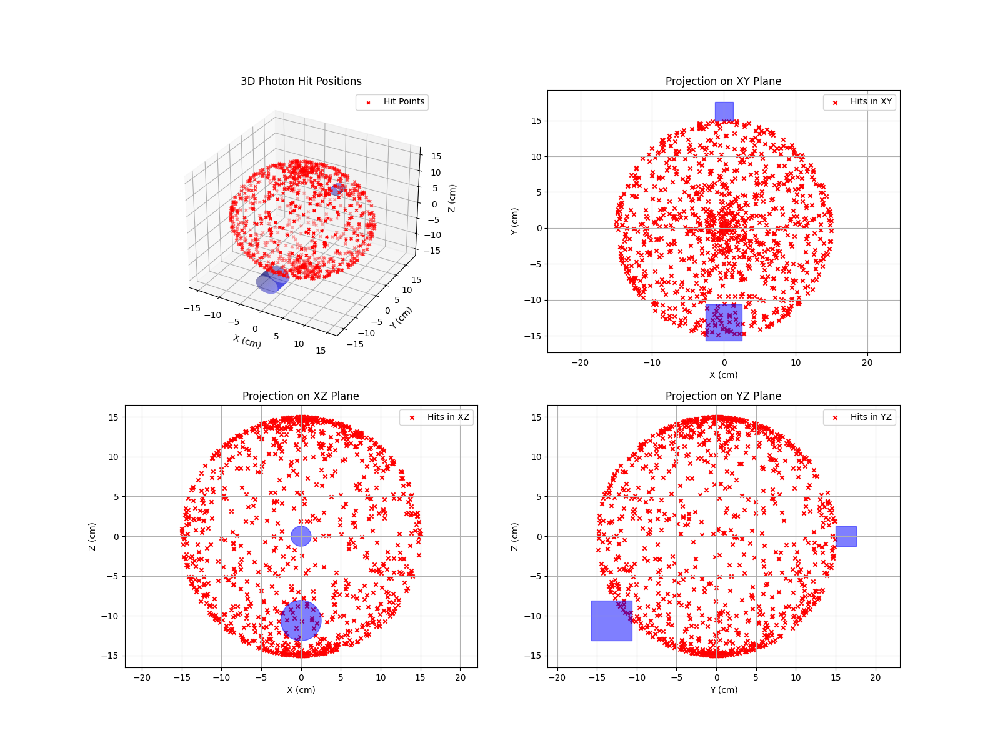

# Gamma Scattering Simulation

This repository provides a comprehensive simulation framework for modeling and analyzing gamma-ray interactions, particularly focusing on Compton scattering experiments. The project is structured with modular classes and functions to facilitate various experimental setups and visualizations.

## Dimension of the physical variables
- Lenght in **cm**.
- Energy in **keV**.

## Table of Contents

- [Overview](#overview)
- [Photon Interaction Types](#photon-interaction-types)
- [Implemented Classes](#implemented-classes)
- [Simulation Experiments](#simulation-experiments)
- [Visualization](#visualization)

## Overview

The simulation framework models gamma-ray interactions specifically for low-energy photons characteristic of the Na-22 spectrum. This radioactive isotope decays via beta-plus (β⁺) decay, producing a positron that subsequently annihilates with an electron, emitting two 511 keV gamma photons in opposite directions. Additionally, Na-22 emits a 1274 keV gamma photon following its decay to an excited state of neon-22. 

<div align="center">
  
</div>

Given the energy range of interest, the simulation focuses on two dominant interaction processes: **Compton scattering** and **photoelectric effect**, omitting **pair production** due to its higher energy threshold. 

The framework provides an environment for simulating real-world particle interactions, supporting key experimental configurations:

- **Gamma-Ray Spectroscopy**: Analyze energy spectra from Na-22, identifying characteristic peaks at 511 keV and 1274 keV.
- **Coincidence Detection**: Simulate the simultaneous detection of 511 keV photons resulting from positron annihilation, crucial for studies in positron emission tomography (PET) and correlated photon measurements.

In addition, the framework integrates 3D visualization tools. These tools allow users to explore photon trajectories, detector arrangements, and scattering targets, enhancing comprehension of photon-matter interactions and supporting intuitive and detailed analysis of gamma-ray behavior and scattering dynamics. 

---

## Photon Interaction Types

In this simulation, the interactions considered are **Compton scattering** and **photoelectric absorption**, as they are the most significant processes for 511 keV photons. **Pair production** is excluded because it occurs only at photon energies above 1.022 MeV, which is beyond the energy range of interest. 

### Thomson scattering cross-section

The **Thomson scattering cross-section** is given by:

$$
\sigma_{\text{Thompson}} = \frac{8}{3} \pi r_e^2
$$

Where $r_e = 2.817 \cdot 10^{-15}$ m is the **classical electron radius**.


### 1. Photoelectric Effect
A photon is completely absorbed by an atom, ejecting an electron with energy equal to the photon's energy minus the binding energy of the electron.

<div align="center">
  
</div>

#### Cross-section calculation
The cross-section for the photoelectric effect is computed using a formula involving the atomic number of the detector material and the photon's energy (form https://en.wikipedia.org/wiki/Gamma_ray_cross_section).

The **Photoelectric cross-section** is computed using:

$$
\sigma_{\text{photoelectric}} = c \left( \frac{Z m_e}{E_{\gamma}} \right)^5 \left( \gamma^2 - 1 \right)^{3/2} \left[ \frac{4}{3} + \frac{\gamma (\gamma - 2)}{\gamma + 1} \left( 1 - \frac{1}{2 \gamma \sqrt{\gamma^2 - 1}} \ln \left( \frac{\gamma + \sqrt{\gamma^2 - 1}}{\gamma - \sqrt{\gamma^2 - 1}} \right) \right) \right]
$$

where:
- $c = \frac{3}{2} \alpha^4 \sigma_{\text{Thomson}}$.
- $\gamma = \frac{E_{\gamma} + m_e - E_b}{m_e}$.
- $E_{\gamma}$ is the **photon energy**.
- $m_e$ = 511 keV is the **electron rest mass energy**.
- $E_b \approx 0$ is the **bond energy** for the electron.
- $Z$ is the **atomic number**.
- $\alpha\approx \frac{1}{137}$ is the **fine-structure constant**.
 
### 2. Compton Scattering
A photon collides with an electron, transferring part of its energy to the electron, which is ejected from the atom. The photon scatters with reduced energy and changes direction.

<div align="center">
  
</div>


#### Cross-section calculation
The cross-section for Compton scattering is computed based on the Thomson scattering cross-section and other parameters like the photon energy and the scattering angle (form https://en.wikipedia.org/wiki/Gamma_ray_cross_section).

The **Compton cross-section** is computed using:

$$
\sigma_{\text{Compton}} = c Z \left[ \frac{(1 + \epsilon)}{\epsilon^2} \left( \frac{2(1 + \epsilon)}{1 + 2\epsilon} - \frac{\ln(1 + 2\epsilon)}{\epsilon} \right) + \frac{\ln(1 + 2\epsilon)}{2\epsilon} - \frac{1 + 3\epsilon}{(1 + 2\epsilon)^2} \right]
$$

where:
- $c = \frac{3}{4} \sigma_{\text{Thomson}}$.
- $\epsilon = \frac{E_{\gamma}}{m_e}$.
- $E_{\gamma}$ is the **photon energy**.
- $m_e$ = 511 keV is the **electron rest mass energy**.

---

### Interaction Probability and Attenuation  

The probability of interaction for a photon traveling through a material depends on the **total cross-section** and material properties such as density and molar mass. This is calculated in two steps:  

#### Attenuation Factor  

The **attenuation factor** is defined as the inverse of the photon's mean free path in the material:  

$$
\mu = \frac{\rho \cdot N_a}{\text{MM}} \cdot \sigma_{tot}
$$

where:  
- $N_a = 6.022\cdot 10^{23}$ 1/mol is the **Avogadro's number**.  
- $\rho$ is the **density** (in g/cm^3) of the scattering material.
- $\text{MM}$ is the **molar mass** (in g/mol) of the scattering material.
- $\sigma_{tot}$ is the **total cross section**, calculated combining the contributions of the photoelectric and Compton cross-sections.

#### Interaction Probability  

Using the attenuation factor, the probability of photon interaction after traveling a distance $d$ in the material is:  

$$
\wp = 1 - e^{-\mu d}
$$    


<div align="center">
  
</div>  


---

## Implemented Classes

The core components of the simulation are encapsulated in several classes:

- **Photon**: Represents a gamma-ray photon, tracking its energy, position, and direction.
- **Electron**: Models an electron that interacts with photons during scattering events.
- **Detector**: Simulates a detector that records the energy and direction of incoming photons.
- **Source**: Represents a gamma-ray source, such as Na-22, used in various experiments.
- **Target**: Models the material medium where Compton scattering occurs.
- **Interaction**: Implements the physics governing Compton scattering and other photon interactions.

---

### 1. `Photon`
```python
photon = Photon(energy: float, direction: list[float], position: list[float] = [0, 0, 0])
```
Represents a photon with energy, direction, and position.
- **Attributes**: `energy`, `direction`, `position`.
- **Methods**:
    - `info()`: Prints detailed information about the photon.
    
  - `propagation(distance)`: Compute photon position after traveling a distance.
    
  - `compton_scattering(angle)`: Calculate scattered photon energy.
    
  - `klein_nishina(angle)`: Compute the differential cross-section for Compton scattering.
    
  - `compton_angle()`: Generate random scattering angles using rejection sampling, using the Klein-Nishina probability density function.
    <div align="center">
      
    </div>

### 2. `Electron`
```python
electron = Electron(energy: float, direction: list[float], position: list[float] = [0, 0, 0])
```
Represents an electron with energy, direction, and position.
- **Attributes**: `energy`, `direction`, `position`.
- **Methods**:
    - `info()`: Prints detailed information about the electron.
    
  - `propagation(distance)`: Compute electron position after traveling a distance.
    
  - `compton_scattering(angle, photon)`: Calculate the energy of the electron after Compton scattering.
 
### 3. `Radioactive source`
```python
source = Source(energies: dict = {511: 0.903, 1274: 0.097}, position: list[float] = [0, 0, 0], activity: int = 127000)
```
Simulates a radioactive source emitting gamma photons. It allows customization of photon energy distributions, spatial positions, and activity levels.

- **Attributes**:`energies`, `position`, `activity`.
- **Methods**:
    - `info()`: Prints detailed information about the radioactive source.

    - `random_energies(number_of_photons: int = 1) -> np.ndarray`: Generates random photon energies based on the source's energy probabilities.
      
    - `random_directions(number_of_photons: int = 1) -> np.ndarray`: Generates random photon directions as unit vectors.
      
    - `photon_emission(number_of_photons: int = 1) -> list`: Generates a list of `Photon` objects with random energies and directions.

    - `testing_photons(self, number_of_photons: int = 1, direction: list = [0, 1, 0]) -> list`: Generates `Photon` objects with fixed directions and random energies.

### 4. `Detector`
```python
detector = Detector(position: list[float], radius: float, width: float, energetic_resolution: float, Z: float = 49.7, density: float = 3.67, molar_mass: float = 149.89)
```

Represents a cylindrical gamma-ray detector with customizable position, size, energy resolution, atomic number, density and molar mass.

- **Attributes**: `position`, `radius`, `width`, `energetic_resolution`,`Z`(defaulting to 49.7 for NaI), `density`(defaulting to 3.67 g/cm^3 for NaI), `molar_mass`(defaulting to 149.89 for NaI).

- **Methods**:
    - `info()`: Prints detailed information about the detector.
      
    - `will_be_in_detector(point: np.ndarray, direction: np.ndarray) -> bool`: Determines if a particle starting at a given point with a specified direction will hit the detector.
      
    - `is_in_detector(point: np.ndarray) -> bool`: Checks if a given point is inside the detector's volume.
      
    - `resolution(energy: float) -> float`: Simulates detector energy resolution by adding Gaussian noise to the true energy.
      
    - `detection(electron: Electron) -> float`: Simulates the energy detected from an electron interacting with the detector.
      
    - `draw_detector_3D(ax, axis='y', color='blue', alpha=0.5, label=None)`:Draws a 3D representation of the detector.
      
    - `draw_detector_2D(ax, plane='xy', color='blue', label=None)`:Draws a 2D projection of the detector on a specified plane.

### 5. `Target`
```python
target = Target(position: list[float], radius: float, width: float,  Z: float, density: float, molar_mass: float)
```

Represents a cylindrical target material with defined position, dimensions, atomic number, density and molar mass.

- **Attributes**: `position`, `radius`, `width`, `Z`, `density`, `molar_mass`.

- **Methods**:
    - `info()`: Prints detailed information about the target.
      
    - `is_in_target(point: np.ndarray) -> bool`:Checks if a given point is inside the target.
      
    - `draw_target_3D(ax, axis='y', color='grey', alpha=0.5, label=None)`: Draws a 3D representation of the cylindrical target along a specified axis.
      
    - `draw_target_2D(ax, plane='xy', color='grey', label=None)`: Draws a 2D projection of the target on a specified plane.

### 6. `Interaction`
```python
interaction = Interaction(type: str)
```
This class allows for the modeling photoelectric effect and Compton scattering, including the calculation of cross-sections and the simulation of the resulting electron or photon-electron pair after the interaction.

- **Attributes**:`type`.
- **Methods**:
    - `info()`: Prints the interaction type.
      
    - `cross_section(photon: Photon, Z)`: Calculates the cross-section for the specified interaction type (photoelectric or Compton).
      
    - `interaction(photon: p.Photon)`: Simulates the interaction (photoelectric or Compton), returning the resulting product (an electron).

---

## Simulation Experiments

1. **Spectroscopy of Na-22 Spectrum**: Simulates the energy spectrum emitted by a Na-22 gamma-ray source, modeling the detection of characteristic energy peaks.
<p align="center">
  
</p>

2. **Coincidence Measurement**: Simulates experiments where two detectors simultaneously measure correlated photon events, such as those from pair production. One detector is the gate and the other is the spettroscopy.
<p align="center">
  
</p>

## Visualization

The project includes 3D visualization capabilities that allow users to:

- Display the gamma-ray source and photon trajectories.
- Visualize the spatial arrangement of detectors and targets.
- Understand the spatial distribution and dynamics of interactions within the simulated environment.

<p align="center">
  
</p>
