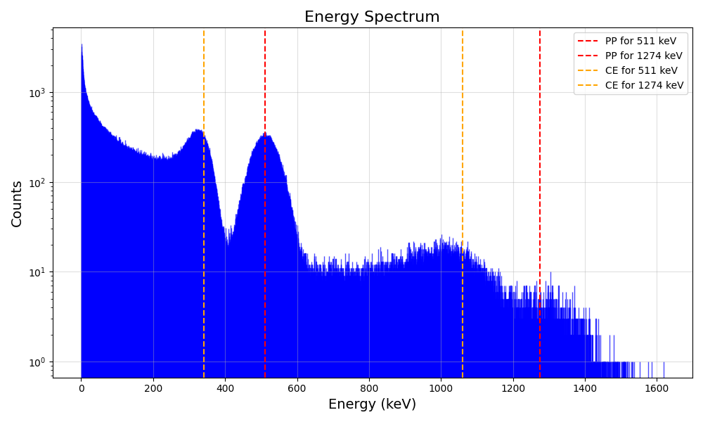
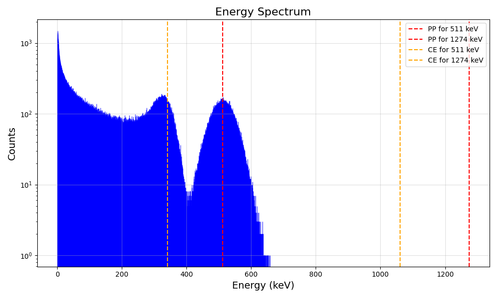
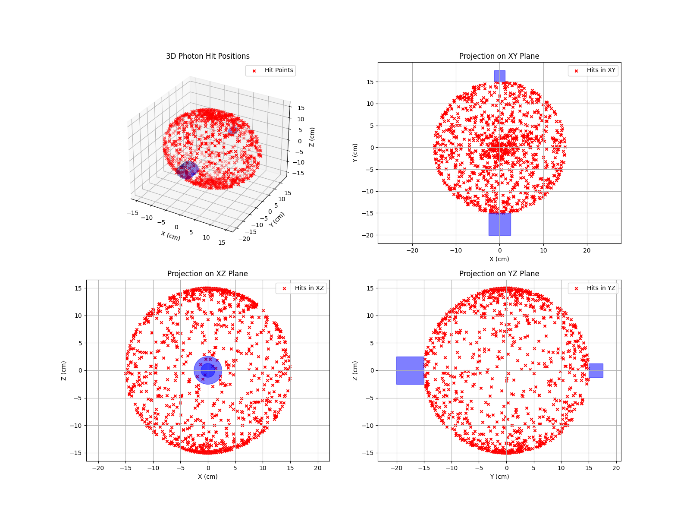

# Gamma Scattering Simulation

This repository provides a comprehensive simulation framework for modeling and analyzing gamma-ray interactions, particularly focusing on Compton scattering experiments. The project is structured with modular classes and functions to facilitate various experimental setups and visualizations.

## Table of Contents

- [Overview](#overview)
- [Photon Interaction Types](#photon-interaction-types)
- [Implemented Classes](#implemented-classes)
- [Simulation Experiments](#simulation-experiments)
- [Visualization](#visualization)

## Overview

The simulation framework models gamma-ray interactions specifically for low-energy photons characteristic of the Na-22 spectrum. This radioactive isotope decays via beta-plus (β⁺) decay, producing a positron that subsequently annihilates with an electron, emitting two 511 keV gamma photons in opposite directions. Additionally, Na-22 emits a 1274 keV gamma photon following its decay to an excited state of neon-22. 

<div align="center">
  
</div>

Given the energy range of interest, the simulation focuses on two dominant interaction processes: **Compton scattering** and **photoelectric effect**, omitting pair production due to its higher energy threshold. The framework provides an environment for simulating real-world particle interactions, supporting key experimental configurations:

- **Gamma-Ray Spectroscopy**: Analyze energy spectra from Na-22, identifying characteristic peaks at 511 keV and 1274 keV.
- **Coincidence Detection**: Simulate the simultaneous detection of 511 keV photons resulting from positron annihilation, crucial for studies in positron emission tomography (PET) and correlated photon measurements.
- **Compton Scattering**: Investigate photon scattering on various target materials to study the angular distribution and energy shift as predicted by Compton’s formula.

In addition, the framework integrates 3D visualization tools. These tools allow users to explore photon trajectories, detector arrangements, and scattering targets, enhancing comprehension of photon-matter interactions and supporting intuitive and detailed analysis of gamma-ray behavior and scattering dynamics. 

---

## Photon Interaction Types

### 1. Photoelectric Effect
A photon is completely absorbed by an atom, ejecting an electron with energy equal to the photon's energy minus the binding energy of the electron.

#### Cross-section calculation
The cross-section for the photoelectric effect is computed using a formula involving the atomic number of the detector material and the photon's energy. (form "A Modern Primer to Particle and Nuclear Physycs" by F.Terranova page 69).

The **Photoelectric cross-section** is computed using:

For $\epsilon << 1$ (low-energy photons):

$$
\sigma_{\text{photoelectric}} = c \cdot Z^5 \cdot \epsilon^{-3.5} \hspace{1.5cm} c = 0.665 \cdot \sqrt{32} \cdot \alpha^4 \cdot b
$$

For $\epsilon >> 1$ (high-energy photons):

$$
\sigma_{\text{photoelectric}} = c \cdot Z^5 \cdot \epsilon^{-1} \hspace{1.5cm} c =  0.665 \cdot \frac{3}{2} \cdot \alpha^4 \cdot b
$$

Where: 
- $\epsilon = \frac{E_{\gamma}}{m_{e}}$
  - $E_{\gamma}$ is the **photon energy**.
  - $m_{e}$ is the **electron rest mass energy**.
- $Z$ is the **atomic number** of the detector.
- $\alpha \approx \frac{1}{137}$ is the **fine-structure constant**.
- $b=10^{-28}$ m $^2$ is the symbol for the **barn** unit.
 
### 2. Compton Scattering
A photon collides with an electron, transferring part of its energy to the electron, which is ejected from the atom. The photon scatters with reduced energy and changes direction.

#### Cross-section calculation
The cross-section for Compton scattering is computed based on the Thomson scattering cross-section and other parameters like the photon energy and the scattering angle.
(form "A Modern Primer to Particle and Nuclear Physycs" by F.Terranova page 71).

The **Compton cross-section** is computed using:

$$
\sigma_{\text{Compton}} = c \cdot Z \left( \frac{(1 + \epsilon)}{\epsilon^2} \left( \frac{2(1 + \epsilon)}{1 + 2\epsilon} - \frac{\ln(1 + 2\epsilon)}{\epsilon} \right) + \frac{\ln(1 + 2\epsilon)}{2\epsilon} - \frac{1 + 3\epsilon}{(1 + 2\epsilon)^2} \right)
$$

Where:
- $\epsilon = \frac{E_{\gamma}}{m_e}$
  - $E_{\gamma}$ is the **photon energy**.
  - $m_{e}$ is the **electron rest mass energy**.
- $Z$ is the **atomic number** of the detector.
- $c$ is a constant: $c = \frac{3}{4} \sigma_{\text{Thompson}}$.

The **Thomson scattering cross-section** is given by:

$$
\sigma_{\text{Thompson}} = \frac{8}{3} \pi r_e^2
$$

Where $r_e = 2.817 \cdot 10^{-15}$ m is the **classical electron radius**.


<div align="center">
  
</div>

---

## Implemented Classes

The core components of the simulation are encapsulated in several classes:

- **Photon**: Represents a gamma-ray photon, tracking its energy, position, and direction.
- **Electron**: Models an electron that interacts with photons during scattering events.
- **Detector**: Simulates a detector that records the energy and direction of incoming photons.
- **Source**: Represents a gamma-ray source, such as Na-22, used in various experiments.
- **Target**: Models the material medium where Compton scattering occurs.
- **Interaction**: Implements the physics governing Compton scattering and other photon interactions.

---

### 1. `Photon`
```python
photon = Photon(energy: float, direction: list[float], position: list[float] = [0, 0, 0])
```
Represents a photon with energy, direction, and position.
- **Attributes**: `energy`, `direction`, `position`.
- **Methods**:
  - `info()`: Print energy and direction.
    
  - `propagation(distance)`: Compute photon position after traveling a distance.
    
  - `compton_scattering(angle)`: Calculate scattered photon energy.
    
  - `klein_nishina(angle)`: Compute the differential cross-section for Compton scattering.
    
  - `compton_angle()`: Generate random scattering angles using rejection sampling, using the Klein-Nishina probability density function.
    <div align="center">
      
    </div>

### 2. `Electron`
```python
electron = Electron(energy: float, direction: list[float], position: list[float] = [0, 0, 0])
```
Represents an electron with energy, direction, and position.
- **Attributes**: `energy`, `direction`, `position`.
- **Methods**:
  - `info()`: Print energy and direction.
    
  - `propagation(distance)`: Compute electron position after traveling a distance.
    
  - `compton_scattering(angle, photon)`: Calculate the energy of the electron after Compton scattering.
 
### 3. `Radioactive source`
```python
source = Source(energies: dict = {511: 0.903, 1274: 0.097}, position: list[float] = [0, 0, 0], activity: int = 127000)
```
Simulates a radioactive source emitting gamma photons. It allows customization of photon energy distributions, spatial positions, and activity levels.

- **Attributes**:`energies`, `position`, `activity`.
- **Methods**:
    - `info()`: Prints possible photon energies, position, and activity.

    - `random_energies(number_of_photons: int = 1) -> np.ndarray`: Generates random photon energies based on the source's energy probabilities.
      
    - `random_directions(number_of_photons: int = 1) -> np.ndarray`: Generates random photon directions as unit vectors.
      
    - `photon_emission(number_of_photons: int = 1) -> list`: Generates a list of `Photon` objects with random energies and directions.

    - `testing_photons(self, number_of_photons: int = 1, direction: list = [0, 1, 0]) -> list`: Generates `Photon` objects with fixed directions and random energies.

### 4. `Detector`
```python
detector = Detector(position: list[float], radius: float, width: float, energetic_resolution: float, Z: float = 49.7)
```

Represents a cylindrical gamma-ray detector with customizable position, size, and energy resolution.

- **Attributes**: `position`, `radius`, `width`, `energetic_resolution`,`Z`(defaulting to 49.7 for NaI).

- **Methods**:
    - `info()`: Prints position, size, and energy resolution.
      
    - `will_be_in_detector(point: np.ndarray, direction: np.ndarray) -> bool`: Determines if a particle starting at a given point with a specified direction will hit the detector.
      
    - `is_in_detector(point: np.ndarray) -> bool`: Checks if a given point is inside the detector's volume.
      
    - `resolution(energy: float) -> float`: Simulates detector energy resolution by adding Gaussian noise to the true energy.
      
    - `detection(electron: Electron) -> float`: Simulates the energy detected from an electron interacting with the detector.
      
    - `draw_detector_3D(ax, axis='y', color='blue', alpha=0.5, label=None)`:Draws a 3D representation of the detector.
      
    - `draw_detector_2D(ax, plane='xy', color='blue', label=None)`:Draws a 2D projection of the detector on a specified plane.

### 5. `Target`
```python
target = Target(position: list[float], radius: float, width: float, density: float = 11.34, Z: float = 82)
```

Represents a cylindrical target material with defined position, dimensions, density, and atomic number. The target is assumed to be made of lead (Pb) by default.

- **Attributes**: `position`, `radius`,`width`, `density`, `Z`.

- **Methods**:
    - `info()`: Prints detailed information about the target.
      
    - `is_in_target(point: np.ndarray) -> bool`:Checks if a given point is inside the target.
      
    - `attenuation(photon: Photon, distance: float) -> float`:Calculates the attenuation of a gamma photon passing through the target.
      
    - `draw_target_3D(ax, axis='y', color='grey', alpha=0.5, label=None)`: Draws a 3D representation of the cylindrical target along a specified axis.
      
    - `draw_target_2D(ax, plane='xy', color='grey', label=None)`: Draws a 2D projection of the target on a specified plane.

### 6. `Interaction`
```python
interaction = Interaction(type: str)
```
This class allows for the modeling photoelectric effect and Compton scattering, including the calculation of cross-sections and the simulation of the resulting electron or photon-electron pair after the interaction.

- **Attributes**:`type`.
- **Methods**:
    - `info()`: Prints the interaction type.
      
    - `cross_section(photon: Photon, detector)`: Calculates the cross-section for the specified interaction type (photoelectric or Compton).
      
    - `interaction(photon: p.Photon)`: Simulates the interaction (photoelectric or Compton), returning the resulting product (an electron).

---

## Simulation Experiments

1. **Spectroscopy of Na-22 Spectrum**: Simulates the energy spectrum emitted by a Na-22 gamma-ray source, modeling the detection of characteristic energy peaks.
<p align="center">
  
</p>

2. **Coincidence Measurement**: Simulates experiments where two detectors simultaneously measure correlated photon events, such as those from pair production. One detector is the gate and the other is the spettroscopy.
<p align="center">
  
</p>

3. **Compton Scattering on a Target**: Models the scattering of photons off a target material, analyzing the energy and angular distribution of the scattered photons.

## Visualization

The project includes 3D visualization capabilities that allow users to:

- Display the gamma-ray source and photon trajectories.
- Visualize the spatial arrangement of detectors and targets.
- Understand the spatial distribution and dynamics of interactions within the simulated environment.

<p align="center">
  
</p>
